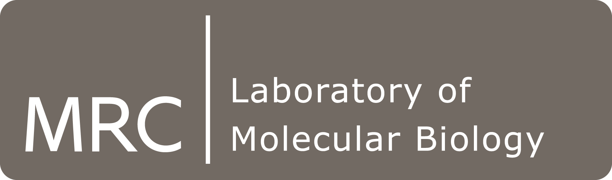

### [http://tinyurl.com/linear-models-r](http://tinyurl.com/linear-models-r)
## Introduction to Linear Models with R - Course Schedule

| Time  | Topic |
| ------------- | ------------- |
| 09.45 - 10.15   | Welcome & Introduction to Rstudio and Markdown (Mark)  |
| 10.15 - 11.30  | Anova (Dominique) {10 min coffee break at 11am*} |
| 11.30 - 13.00  | Simple Regression (Rob)  |
| 13.00 - 14.00 | Lunch Break  |
| 14.00 - 15.15 | Multiple Regression (Rob) |
| 15.15 -15.30 | { 15 min Tea break* }  |
| 15.30 - 16.45  | GLMs (Dominique)  |
| 16.45 - 17.15 | Time-series (Rob) |
| 17.15 - 17.25  | Conclusion  |

*Coffee, Tea, Water & Cookies provided

